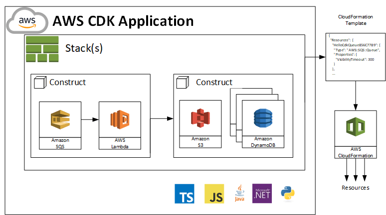

# AWS CDK - Cloud Development Kit

Grupo de Usuarios de AWS Ciudad de México  
2020-02-18

## AWS CDK Workshop

<https://cdkworkshop.com/>

## Requisitos

* [Instalar AWS CLI](https://cdkworkshop.com/15-prerequisites/100-awscli.html) o [AWS CLI v2](https://docs.aws.amazon.com/cli/latest/userguide/install-cliv2.html)
* [Cuenta y Usuario de AWS](https://cdkworkshop.com/15-prerequisites/200-account.html)
* [Acceso a un IDE (Visual Studio Code por ejemplo)](https://cdkworkshop.com/15-prerequisites/400-ide.html)
* [Instalar Node.js](https://cdkworkshop.com/15-prerequisites/300-nodejs.html). Si están en Linux o MacOS les recomiendo con [nvm](https://github.com/nvm-sh/nvm)
* [Instalar AWS CDK Toolkit](https://cdkworkshop.com/15-prerequisites/500-toolkit.html)

## Conceptos Generales

* Infraestructura como Código
* DevOps
* Control de Versiones
* AWS CloudFormation
* AWS CDK (Cloud Development Kit)

## Componentes

* AWS CDK CLI (Command Line Interface)
* AWS CDK Framework
* AWS Construct Library

## Lenguajes

* JavaScript
* TypeScript
* Python
* Java
* .NET

## Conceptos CDK

* Aplicación
* Stack
* Construct
* CFN Resources

## Comandos básicos

* `cdk bootstrap aws://<account>/<region>` o `cdk bootstrap --app <application>`  
  Inicializa CDK, crea una cubeta para los artefactos
* `cdk init`  
  Crea una nueva aplicación
* `cdk list`  
  Muestra los stacks en la aplicación
* `cdk synth > cloudformation_template.yaml`  
  Genera el script de CloudFormation en la consola
* `cdk diff`  
  Muestra los cambios a realizar
* `cdk deploy`  
  Despliega la aplicación en nuestra cuenta
* `cdk destroy`  
  Destruye todos los recursos

> Nota: Se puede agregar el parámetro `<stack>` para desplegar solo un stack de la aplicación.  
> Nota: Agregar `--profile <profile>` para definir el profile a utilizar

## Referencias

* [Workshop](https://cdkworkshop.com/)
* [AWS Cloud Development Kit (AWS CDK) Developer Guide](https://docs.aws.amazon.com/cdk/latest/guide/home.html)
* [Repositorio GitHub](https://github.com/aws/aws-cdk)
* [AWS CDK API Reference](https://docs.aws.amazon.com/cdk/api/latest/docs/aws-construct-library.html)
* [AWS CDK Examples](https://github.com/aws-samples/aws-cdk-examples)
* [Awesome CDK](https://github.com/eladb/awesome-cdk)

